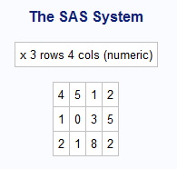

####Create a Matrix in r: 

```{r}
x <- matrix( c(4,5,1,2,1,0,3,5,2,1,8,2), nrow=3, ncol=4, byrow=TRUE)
x
```
  
  
  
####Create a Matrix in SAS: 

proc iml;

reset print;

x ={4 5 1 2,
	1 0 3 5,
	2 1 8 2}
; 
run;


